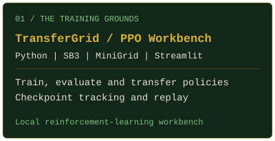
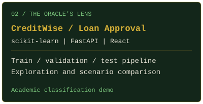
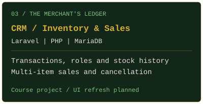
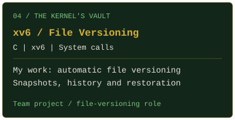
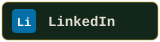

<!-- Hero Banner -->

  

  

 

  
Public projects in machine learning, reinforcement learning, databases and operating systems.

<!-- Tech Stack: technologies used in the public projects below -->

 

 

 

 

 

 

 

  

 

<!-- Quest Log -->

  
   
  
  
   
  
  
  
<a href="https://github.com/Szaman07/CSE299_TransferGrid">TransferGrid</a> &nbsp; | &nbsp;
  <a href="https://github.com/Szaman07/CSE445-Loan-Approval">CreditWise</a> &nbsp; | &nbsp;
  <a href="https://github.com/Szaman07/CSE311-CRM">NexaStock</a> &nbsp; | &nbsp;
  <a href="https://github.com/Szaman07/CSE323_OS_project-xv6-">xv6 File Versioning</a>

  
TransferGrid, CreditWise and NexaStock are individual projects. 
  For the xv6 team project, I implemented automatic file versioning; my teammate implemented symbolic links.

 

  

 

<!-- Connections -->

  
  &nbsp;&nbsp;&nbsp;&nbsp;
  

<!-- Footer -->

   
  
    

