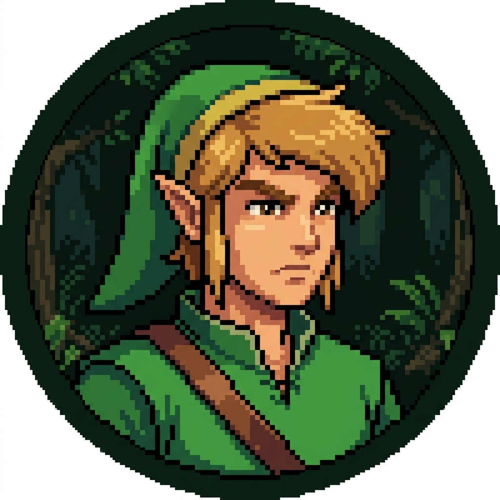

<!-- ═══════════════════════════════════════════════════════════════════ -->
<!--                    HEADER BANNER (Full Width)                     -->
<!-- ═══════════════════════════════════════════════════════════════════ -->

<div align="center">
  
</div>


<!-- ═══════════════════════════════════════════════════════════════════ -->
<!--                    TWO-COLUMN LAYOUT                              -->
<!-- ═══════════════════════════════════════════════════════════════════ -->

<table>
<tr>

<!-- ════════════════════════════════════════════════════════════════ -->
<!--                       LEFT SIDEBAR                             -->
<!-- ════════════════════════════════════════════════════════════════ -->

<td width="260" valign="top">

<div align="center">

<br/>

<!-- Avatar -->


<br/><br/>

**Sadman Zaman**
<br/>
<sub>@Szaman07</sub>

<br/><br/>

</div>

---

<div align="center">

**ABOUT ME**

</div>

<br/>

Senior CS Undergrad from Bangladesh.
Passionate about building systems, exploring AI, and creating tools that make a difference.

<br/>

---

<div align="center">

**FOCUS AREAS**

</div>

<br/>


<br/>

<br/>

<br/>


<br/><br/>

---

<div align="center">

**CONNECT**

</div>

<br/>

<div align="center">

<a href="https://github.com/Szaman07"></a>
&nbsp;
<a href="https://www.linkedin.com/in/sadman-zaman-724056216/"></a>
<br/>
<a href="https://www.facebook.com/Sadman.Zaman07/"></a>
&nbsp;
<a href="mailto:sadman.zaman@northsouth.edu"></a>

</div>

<br/>

---

<div align="center">
  
</div>

</td>

<!-- ════════════════════════════════════════════════════════════════ -->
<!--                       MAIN CONTENT                             -->
<!-- ════════════════════════════════════════════════════════════════ -->

<td valign="top">

<br/>

<!-- ─────────────── TECH STACK ─────────────── -->

<div align="center">

```
◆ ═══════════════════ TECH STACK ═══════════════════ ◆
```

</div>

**◆ Programming Languages**

<p>


</p>

**◆ Frontend Technologies**

<p>


</p>

**◆ Backend / Frameworks**

<p>


</p>

**◆ Databases**

<p>


</p>

**◆ Machine Learning / Data Science**

<p>


</p>

**◆ Dev Tools & Platforms**

<p>


</p>

**◆ Documentation & Design**

<p>


</p>

<br/>


<br/>

<!-- ─────────────── ADVENTURE LOG ─────────────── -->

<div align="center">

```
◆ ═══════════════ ADVENTURE LOG ═══════════════ ◆
```

</div>

<div align="center">


</div>

<br/>


<br/>

<!-- ─────────────── QUESTS ─────────────── -->

<div align="center">

```
◆ ══════════════════ QUESTS ══════════════════ ◆
```

<br/>

<sub>

*The hero's quests are being prepared...*
<br/>
*Featured projects will appear here once polished and battle-ready.*

</sub>

</div>

<br/>

</td>

</tr>
</table>

<!-- ═══════════════════════════════════════════════════════════════════ -->
<!--                          FOOTER                                   -->
<!-- ═══════════════════════════════════════════════════════════════════ -->


<div align="center">
<br/>

```
◆ Thanks for visiting! May the Triforce guide you. ▲
```

<br/>
</div>
