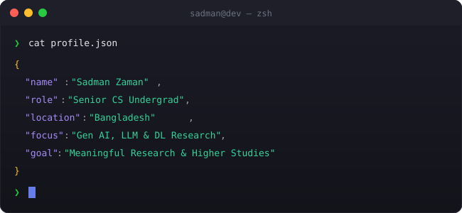

  
  <!-- ═══════════════════════════════════════════════════════════════════════════ -->
  <!-- ZELDA THEMED HEADER                                                         -->
  <!-- ═══════════════════════════════════════════════════════════════════════════ -->
  
  
  

 

<!-- ═══════════════════════════════════════════════════════════════════════════ -->
<!-- TERMINAL INTRO SECTION (The part you liked!)                               -->
<!-- ═══════════════════════════════════════════════════════════════════════════ -->

  

 

 

<!-- ═══════════════════════════════════════════════════════════════════════════ -->
<!-- TECH STACK                                                                  -->
<!-- ═══════════════════════════════════════════════════════════════════════════ -->

  

 

<h4>Languages & Systems</h4>

  

<h4>Data Science & Machine Learning</h4>

  

<h4>Full Stack & Tools</h4>

  

 

 

<!-- ═══════════════════════════════════════════════════════════════════════════ -->
<!-- CONNECT WITH ME                                                             -->
<!-- ═══════════════════════════════════════════════════════════════════════════ -->

  

 

  

&nbsp;

&nbsp;

 

<!-- ═══════════════════════════════════════════════════════════════════════════ -->
<!-- END OF README                                                               -->
<!-- ═══════════════════════════════════════════════════════════════════════════ -->
