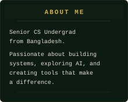
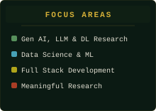
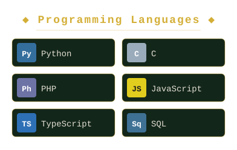
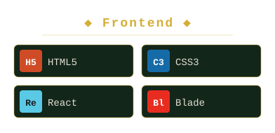
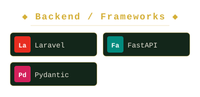
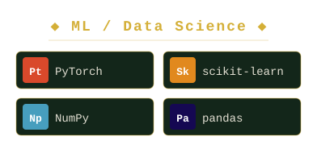
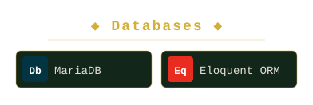
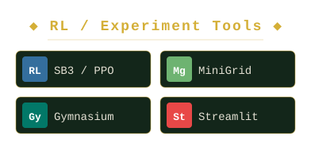
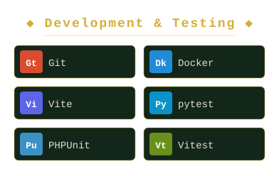

<!-- ═══════════════════════════════════════════════════════════════════ -->
<!--              HERO BANNER (Full Width, Above Table)                -->
<!-- ═══════════════════════════════════════════════════════════════════ -->

  

<!-- ═══════════════════════════════════════════════════════════════════ -->
<!--                    TWO-COLUMN LAYOUT                              -->
<!-- ═══════════════════════════════════════════════════════════════════ -->

<table>
<tr>

<!-- ═══════════ LEFT SIDEBAR ═══════════ -->
<td width="240" valign="top" align="center">

 

  

  

<!-- Connect (clickable) -->

&nbsp;

&nbsp;

  

 

</td>

<!-- ═══════════ MAIN CONTENT ═══════════ -->
<td valign="top">

 

<!-- Tech Stack Header -->

  

 

<!-- Programming Languages -->

<!-- Frontend Technologies -->

<!-- Backend / Frameworks -->

<!-- Databases -->

<!-- Machine Learning / Data Science -->

<!-- Dev Tools & Platforms -->

<!-- Documentation & Design -->

 

 

<!-- Adventure Log -->

 

 

<!-- Quest Log -->

  

 

</td>

</tr>
</table>

<!-- ═══════════════════════════════════════════════════════════════════ -->
<!--                          FOOTER                                   -->
<!-- ═══════════════════════════════════════════════════════════════════ -->

   
  
    

